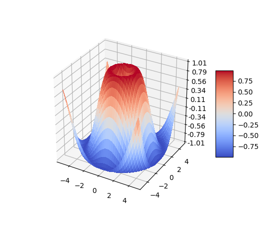

The goal of any data scientist is using the tools available in programming and statistics to solve real-life problems, from medicine to finance. Sometimes a data scientist has to create his tools or weapons for tackling those issues, but if those tools are available (free or paid), it's better to save time and solve the problem faster. If a data scientist has to build from scratch the code and tools that other data scientists created before, the process wouldn't be as fast, and there would be fewer problems solved in this world!

So here comes the function concept in programming, which is essential for any workflow in data science. The primary objective of a function is "recycling" the building blocks someone created before. It's the same as thinking about construction materials like steel. If someone constructing a building has to produce the required steel and extract it from a mine, the length of any construction project would be never-ending. The same occurs with programming and data science.

Functions in Python are the way of creating something and recycling it every time you need it. Functions are the building blocks of **libraries** and **packages**, which contain different tools that make a data scientist's job easier. They include tons of functions combined for various purposes. Some of the most important Python libraries for data scientists are:

* **numpy**: useful for advanced and complex mathematical calculations.
* **matplotlib**: useful for creating engaging graphs.
* **scikit**: has several of the most used algorithms in machine learning and data science.



**Image 1.** Matplotlib graph example. From https://matplotlib.org/examples/mplot3d/surface3d_demo.html

Also, Python comes with dozens of built-in functions and lets its users build their custom ones. Some of the most relevant Python built-in functions are: `len()`, `sum()`, `max()`, `list()`, `str()`. If a Python built-in function can't accelerate the programming process, it's recommended to check if there's a library available for solving it.

If there's not a built-in function or a library (just Google it better because there are millions of Python developers in the world creating content) to solve the process, then it's time to make a function in Python from scratch. Before creating custom functions in Python, it's important to know their basic structure and components:

`def`: this statement is always used to define a new function. The name of the function goes after this declaration.

`return`: this statement determines the output of a function. If a function doesn't contain this statement, it's almost useless because it won't output any value to the rest of the program.

`(parameters)`: the parameters define the type and order of the information that the function will be receiving and processing.

`documentation`: contains basic instructions for how to use the function.

Next, we can see the previous structure deployed in real code:

```
def anyNameYouWant(par1, par2):
'''anyNameYouWant helps you converting from apples to lemons'''

	output = par1 / par2
	return output
```
Anytime you want to reuse the code inside the function `anyNameYouWant` you just have to call its name and send the required parameters, just like *Wingardium Leviosa* or any other spell. This function returns an output, so it's better to store it in a variable or list.

There is another type of function in Python for other specific uses called `lambda`. `lambda` functions are small anonymous functions designed for executing just a basic command, and they don't have a return statement because they always store their output in an expression. Even though they sound complicated, especially their name, they're an easy way of repeating simple tasks. We can rewrite the function `anyNameYouWant` as a `lambda` function:

`anyNameYouWant = lambda par1, par2: par1 / par2;`

In this case, the components of this `lambda` function are:

`expression`: an expression named the same way as the previous function, stores the output of the process.

`lambda`: this command assigns the process to the previous expression.

`parameters`: the expression will always receive some parameters for running the process, working the same way as the conventional function.

If you want to execute this `lambda` you only have to call the expression with both parameters:

`print (anyNameYouWant(5,4))`

For simple and repetitive commands, `lambda` functions are more efficient than conventional functions.

Python has different alternatives for creating reusable code and for creating projects in a fast way. It's important to know them all and apply these techniques to the daily coding experience. Coding isn't like Machiavelli's "The Prince," in which he says that "the end justifies the means". In code, the means are as important as the end because if the code isn't maintainable and reusable, it won't be useful for the rest of the community and even for its author in the future.
